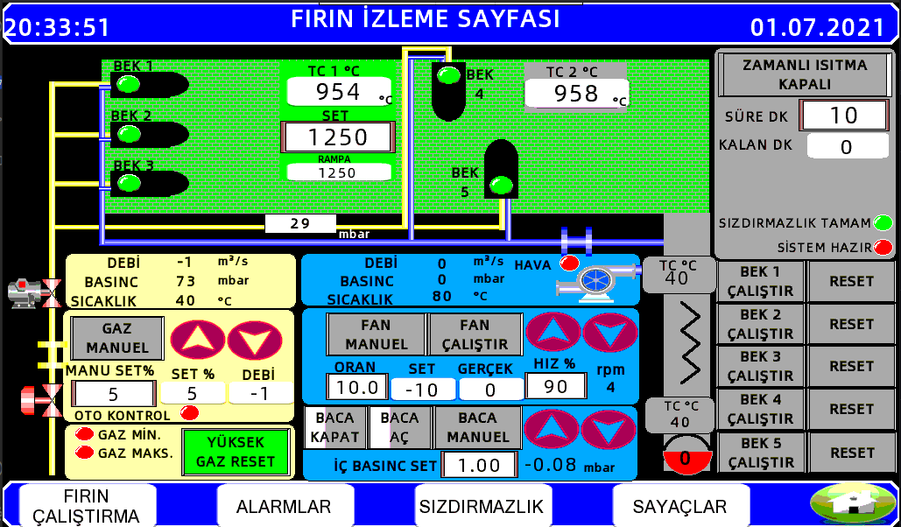
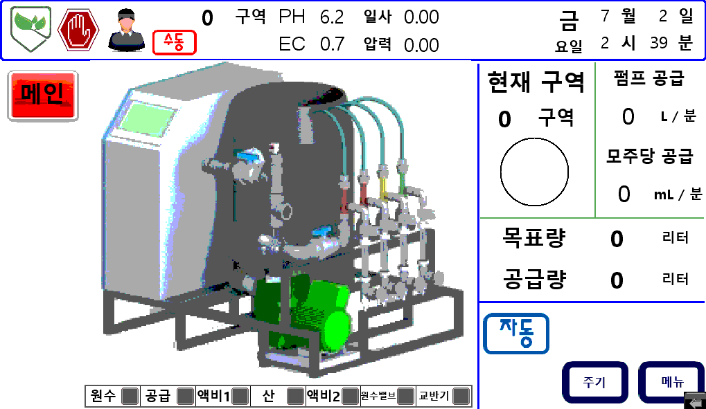
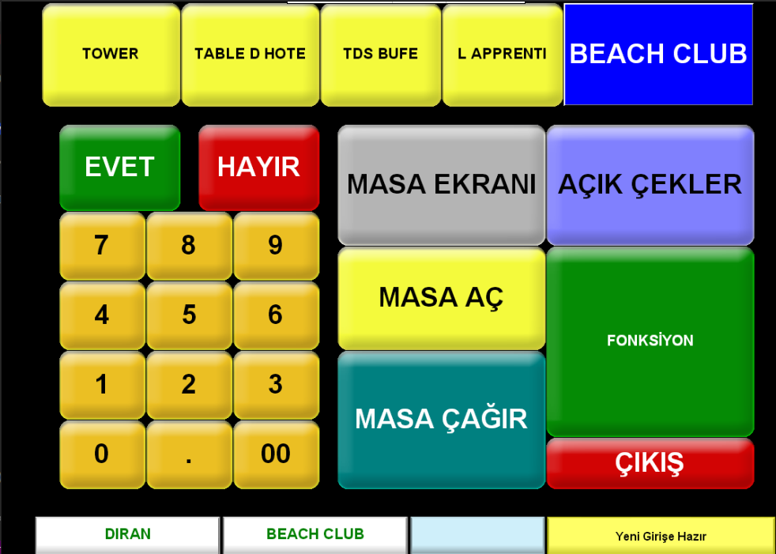
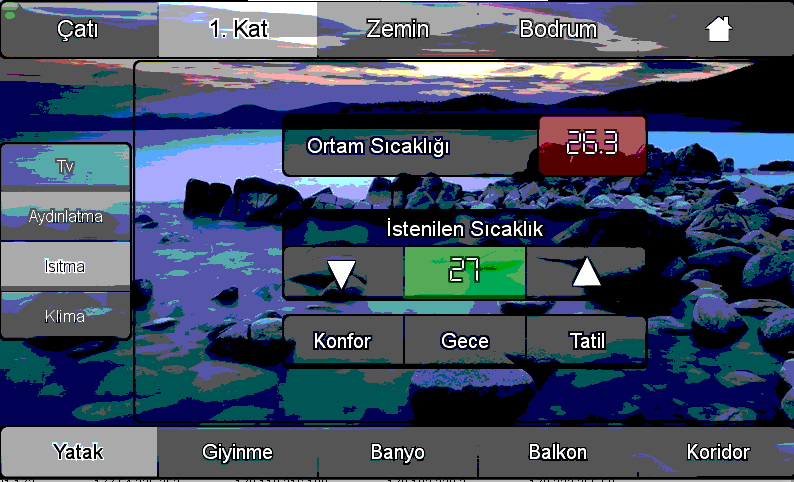

<h3 align="center">The VNC Destroyer</h3>

  <p align="center">
    <a href="https://github.com/aydinnyunus/VNCBruteForce/issues">Report Bug</a>
    ·
    <a href="https://github.com/aydinnyunus/VNCBruteForce/issues">Request Feature</a>
  </p>
</p>


<!-- TABLE OF CONTENTS -->
<details open="open">
  <summary>Table of Contents</summary>
  <ol>
    <li>
      <a href="#getting-started">Getting Started</a>
      <ul>
        <li><a href="#prerequisites">Prerequisites</a></li>
        <li><a href="#authentication">Authentication</a></li>
        <li><a href="#installation">Installation</a></li>
      </ul>
    </li>
    <li>
      <a href="#usage">Usage</a>
         <ul>
            <li><a href="#agent-installation">Agent Installation</a></li>
         </ul>
   </li>
    <li><a href="#dorks">Dorks</a></li>
    <li><a href="#roadmap">Roadmap</a></li>
    <li><a href="#contributing">Contributing</a></li>
    <li><a href="#contact">Contact</a></li>
  </ol>
</details>

<!-- GETTING STARTED -->

## Getting Started

General information about setting up VNC Destroyer

### Prerequisites

Required softwares and installations.

* Install Shodan CLI [🔎 &#x2192;](https://help.shodan.io/command-line-interface/0-installation)

* Install Hydra [🔎 &#x2192;](https://www.geeksforgeeks.org/how-to-install-and-use-hydra-in-linux/)

### Authentication
#### via CLI

   ```sh
   shodan init
   ```

or

   ```sh
   ./vnc-destroyer -i
   ```
  
  

Then, enter your Shodan API Token when prompted.

#### via flags

```sh
   ./vnc-destroyer --shodan-api-key=YOUR_TOKEN
```


### Dorks

### Unprotected VNC [🔎 &#x2192;](https://www.shodan.io/search?query=%22authentication+disabled%22+%22RFB+003.008%22)

```
"authentication disabled" "RFB 003.008"
```
### Searching VNC Servers [🔎 &#x2192;](https://www.shodan.io/search?query=%22port:5900%22)

```
"port:5901 country:XX"
"port:5900 country:XX"
"port:5800 country:XX"
```

<p align="center">
  <br />
  <em>Oven Monitoring Page</em>
</p>

<p align="center">
  <br />
  <em>I don't know what it is but seems like important</em>
</p>

<p align="center">
  <br />
  <em>Ordering System for Waiters</em>
</p>

<p align="center">
  <br />
  <em>Temperature & Light Control System</em>
</p>


## Roadmap

See the [open issues](https://github.com/aydinnyunus/VNCBruteForce/issues) for a list of proposed features (and known issues).


<!-- CONTRIBUTING -->

## Contributing

Contributions are what make the open source community such an amazing place to be learn, inspire, and create. Any
contributions you make are **greatly appreciated**.

1. Fork the Project
2. Create your Feature Branch (`git checkout -b feature/AmazingFeature`)
3. Commit your Changes (`git commit -m 'Add some AmazingFeature'`)
4. Push to the Branch (`git push origin feature/AmazingFeature`)
5. Open a Pull Request


<!-- CONTACT -->

## Bug / Feature Request :man_technologist:
If you find a bug (the application couldn't handle the query and / or gave undesired results), kindly open an issue [here](https://github.com/aydinnyunus/VNCBruteForce/issues/new) by including your search query and the expected result.

If you'd like to request a new function, feel free to do so by opening an issue [here](https://github.com/aydinnyunus/VNCBruteForce/issues/new). Please include sample queries and their corresponding results.

## Connect with me! 🌐

[](https://linkedin.com/in/yunus-ayd%C4%B1n-b9b01a18a/)       [](https://github.com/aydinnyunus/WhatsappBOT)     [](https://instagram.com/aydinyunus_/) [](https://twitter.com/aydinnyunuss)
